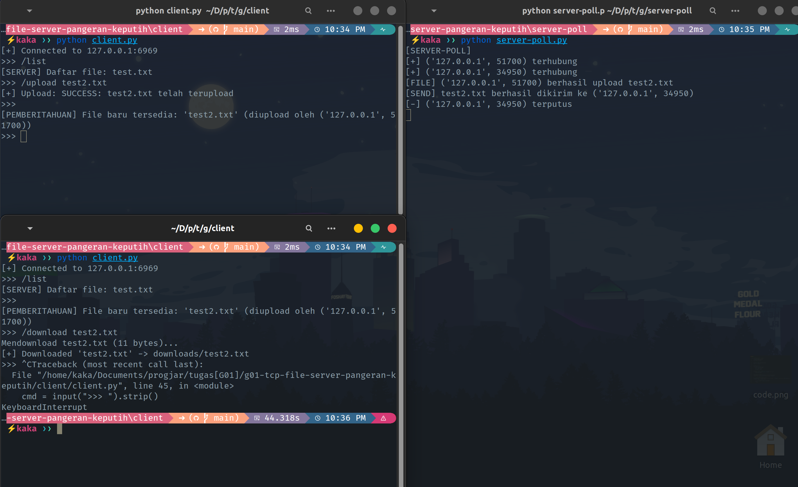
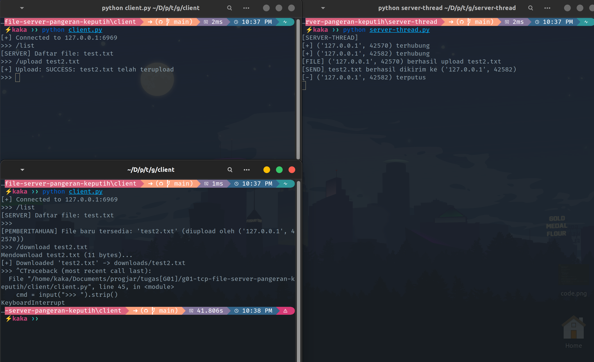

# Network Programming - Assignment G01

## Anggota Kelompok
| Nama           | NRP        | Kelas     |
| ---            | ---        | ----------|
| Christian Mikaxelo               |    5025241178        |   C        |
| Ahmad Loka Arziki               |   5025241044         |    C       |

## Link Youtube (Unlisted)
Link ditaruh di bawah ini

[Link video demo](https://youtu.be/pETmrocKAC4)

## Penjelasan Program

### server-sync.py
Server synchronous (blocking) hanya melayani satu client dalam satu waktu.
- `socket.listen(1)` hanya antri 1 koneksi
- `accept()` blocking, menunggu client masuk
- `conn.recv()` blocking, menunggu data dari client
- `handle_client()` memproses semua command client hingga disconnect, baru terima client berikutnya

### server-select.py
Server non-blocking menggunakan I/O multiplexing bisa melayani banyak client sekaligus dalam satu thread.
- `select.select(sockets, [], [])` untuk cek semua socket, return yang sudah ready
- `sockets` list berisi server socket dan semua client socket yang aktif
- `server.accept()` dipanggil hanya ketika `select` mendeteksi koneksi client baru
- `conn.recv()` dipanggil hanya ketika `select` mendeteksi data masuk
- setelah upload berhasil, server iterasi semua socket aktif dan kirim notifikasi ke semua client lain

### server-poll.py
Implementasi I/O multiplexing menggunakan syscall `poll` untuk memantau banyak socket sekaligus dalam satu thread.
- `select.poll()` membuat objek poller yang bertugas mengelola daftar file descriptor (FD) yang akan dipantau statusnya.
- `poll_obj.poll()` mengambil daftar FD yang sedang aktif atau memiliki data masuk (event POLLIN) untuk segera diproses.
- `fd_map` memetakan ID angka dari file descriptor kembali ke objek socket-nya supaya fungsi `recv()` bisa dijalankan pada socket yang tepat.
- `poll_obj.register()` mendaftarkan socket client yang baru terhubung ke dalam daftar pantauan poller secara dinamis tanpa menghentikan perulangan utama.

### server-thread.py
Server multi-threaded yang menjalankan satu thread khusus untuk melayani setiap client yang terhubung secara paralel.
- `threading.Thread()` membuat jalur eksekusi mandiri untuk setiap client sehingga proses komunikasi dan transfer file tidak perlu mengantri.
- `clients_lock` (Lock) menjaga konsistensi data saat server melakukan iterasi pada list `clients` untuk broadcast agar tidak terjadi *race condition*.
- `handle_client()` menjalankan seluruh logika perintah (`/list`, `/upload`, `/download`) secara terisolasi di dalam masing-masing thread pekerja.
- Thread utama hanya fokus pada fungsi `accept()` untuk menerima koneksi baru, sementara thread pekerja menangani seluruh beban kerja komunikasi secara independen.

## Screenshot Hasil

### Server Sync

dari test berikut dapat dilihat bahwa server hanya memberikan response kepada 1 client saja, sementara client yang mencoba connect, tidak bisa karena blocking dari server. Bahkan mencoba /list saja tidak bisa. Dengan ini, maka sesuai dengan implementasi sync yaitu blocking

### Server Select

dari test berikut dapat dilihat bahwa client 1 dan 2 dapat connect ke server dan setiap requestnya dapat diproses secara synchronous. Namun, delay nya tidak terasa karena request yang dilakukan sederhana dan terjadi di local sehingga sangat cepat.

Dapat dilihat juga server broadcast ke semua client lain ketika ada file yang di-upload. Client menggunakan background thread untuk menerima broadcast, namun untuk menghindari race condition, digunakan `threading.Event` (`command_active`) broadcast thread di-pause saat main thread sedang mengeksekusi command, lalu diaktifkan kembali setelah selesai.

Untuk transfer file, digunakan **length prefix** (4-byte big-endian header) sebagai framing server kirim ukuran file terlebih dahulu, lalu client baca sejumlah byte tersebut, sehingga data antar pesan tidak tercampur.

### Server Poll

Berdasarkan gambar, `server-poll.py` terbukti bisa melayani beberapa client secara bersamaan tanpa terjadi *blocking*. Hal ini terlihat dari adanya dua client yang terhubung (`127.0.0.1:51700` dan `34950`) di mana keduanya bisa mengirim perintah `/list` dan `/upload` secara bergantian tanpa harus menunggu salah satu terputus.

Selain itu, mekanisme **broadcasting** berhasil dijalankan dengan sukses. Begitu client pertama selesai mengunggah file `test2.txt`, server langsung mengirimkan pesan pemberitahuan otomatis ke client kedua (seperti yang terlihat pada terminal client di bagian bawah). Karena menggunakan I/O multiplexing, semua aktivitas ini terjadi dalam satu proses utama yang efisien.

### Server Thread

Pada versi thread, gambar menunjukkan bahwa server mampu menangani koneksi paralel dengan membuat jalur eksekusi terpisah untuk setiap client. Terlihat pada terminal server bahwa dua client (`42570` dan `42582`) dapat terhubung dan berinteraksi secara mandiri tanpa saling mengganggu.

Proses **broadcasting** juga berjalan lancar; saat client pertama berhasil melakukan upload, client kedua langsung menerima pesan "[PEMBERITAHUAN] File baru tersedia". Server tetap bisa melayani permintaan dari client lain meskipun ada aktivitas upload yang sedang berlangsung karena setiap client sudah ditangani oleh thread masing-masing.
